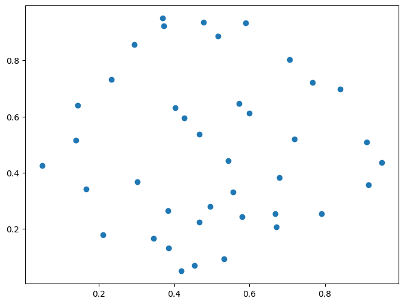
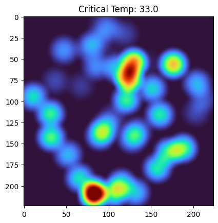
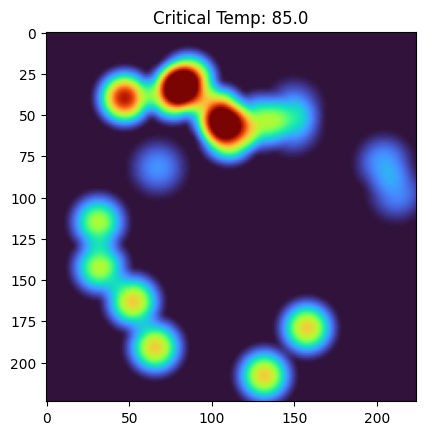
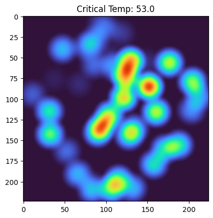
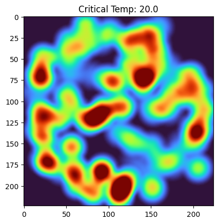
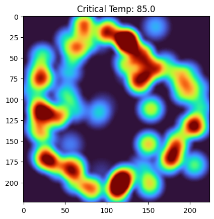
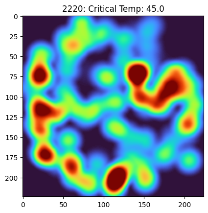
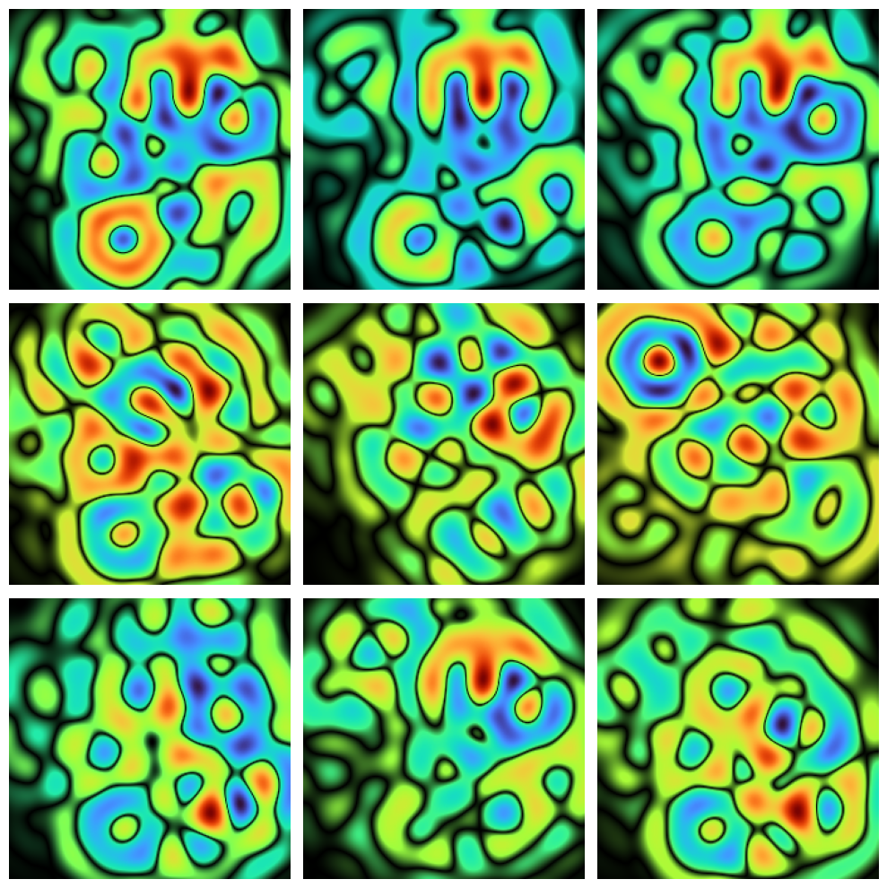

# ALICE: Tabular-to-Image via Metaballs
**A**ttenuation-based **L**ayout **I**mage **C**reation for **E**ncoding

There is a growing trend in machine learning to convert tabular data into images to take advantage of powerful pre-trained CNNs.

I was curious to see if I could use metaballs to encode tabular data points into images. Turns out it can be done and decent models can be obtained with minimal effort.

### The Idea
**Arrangement**: Features are positioned in 2D space using MDS. Features that are highly correlated sit closer together.

**Representation**: Instead of a single pixel, each feature is a "metaball" with a **Cosine Attenuation** curve (a smooth glow with a defined radius of influence).

| | | |
|----------------|----------------|----------------| 
|  |  |  |

* **Interaction**: Overlapping glows create distinct shapes allowing the CNN to see how features interact.
**Color**: Used the **Turbo palette** to take full advantage of the RGB color space.

Open the [Jupyter notebook](https://github.com/mgeorgoulopoulos/alice_tabular_to_image/blob/main/alice.ipynb) for a detailed view of the steps I took.

## Results
I tested this on the UCI Superconductor dataset to predict the target variable (superconductor critical temperature). 

* **Baseline**: The [original 2018 paper](https://www.sciencedirect.com/science/article/abs/pii/S0927025618304877?via%3Dihub) used XGBoost and reached ~9.5 RMSE.
* **My Result**: This visual approach reached a **test MAE of ~8.75**.

While not breaking any records, this experiment proves the viability of the concept. It demonstrates that a vision-based model can "learn" physics from an abstract heatmap as effectively as traditional algorithms learn from raw tables.

This was a first-pass to see if the concept held water. Since it worked out-of-the-box, there is significant room for improvement:

* **Wasted variance**: I PCA-encoded many correlated features (reducing the features from 81 to 40) using just the **first principal component**, dropping a significant amount of variance. Including PC2 and beyond will improve the result.
* **Image generation**: all variables in this test are my initial guess: cosine attenuation function, radius, "turbo" colormap etc.
* **Model selection**: ResNet50 is the only model I tried.
* **Training**: I just trained once (took a night on my personal computer). The resulting model overfits the training set as the validation MAE is a bit better (~7.5).

## Verdict

The fact that a model pre-trained on photographs of cats and dogs can be "tricked" into predicting superconductivity via metaball topography is fascinating. ALICE shows that we don't always need to feed models raw numbers—sometimes, showing them a picture of the data's "texture" is enough to reveal the underlying physics.

# Updates

## v2 - Dec 29 2025

As expected, adding PCA components beyond the first one improved the situation:

* Better **MAE of 6.85**
* **No overfitting**: the model generalizes nicely to the unseen test set.
* Denser, more visually appealing images.

| | | |
|------------------|------------------|------------------| 
|  |  |  |

## v3 - Jan 3 2026

Changed a few things which slightly dropped the test MAE to **6.68**.

* Removed the second scaling, preserving PCA feature relative magnitude.
* Extended the radius of influence.
* Allowed for both constructive and destructive interference between features.
* Played around with the model a bit: "elu" instead of "relu" for the final "dense" regression layer and Max instead of Average pooling.

